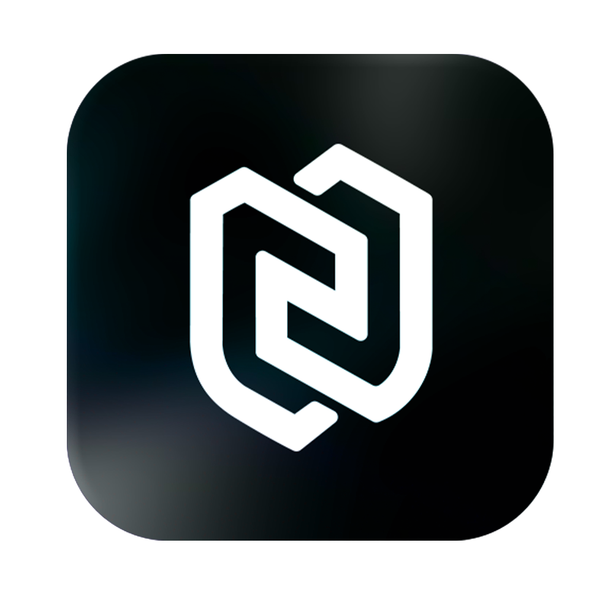

<div align="center">
  
  <h1>NexStack Starter 🚀</h1>
  <p>
    <b>Enterprise-grade fullstack starter for rapid SaaS development</b>
  </p>
  <p>
    Un boilerplate moderno y production-ready que combina Next.js 16.1.6 y NestJS con autenticación completa, RBAC, y arquitectura escalable. Diseñado para ser <b>la base sólida de tu próximo proyecto</b>.
  </p>
  
  <p>
    <a href="https://github.com/dojolabgt/NexStack-Starter.git">
      
    </a>
  </p>

</div>

---

## 🛠 Tech Stack

<div align="center">
  
  
  
  
  
  
  
  
  
  

  
  
  
</div>

---

## 🚀 Instalación y Puesta en Marcha

Sigue estos pasos para levantar el proyecto en tu entorno local.

### 1. Clonar el Repositorio

```bash
git clone https://github.com/dojolabgt/NexStack-Starter.git
cd NexStack-Starter
```

### 2. Configuración de Variables de Entorno

Copia el archivo de ejemplo para crear tu configuración local:

```bash
cp .env.example .env
```

**Nota**: El archivo `.env.example` ya viene con una configuración funcional para desarrollo local con Docker.

### 3. Iniciar con Docker Compose

Levanta todos los servicios (Frontend, Backend, Base de Datos) con un solo comando:

```bash
# Iniciar en modo desarrollo (con hot-reload)
docker compose -f docker-compose.dev.yml up --build
```

**Servicios disponibles:**
- 🎨 **Dashboard**: [http://localhost:3000](http://localhost:3000)
- 🌐 **Sitio Público**: [http://localhost:3001](http://localhost:3001)
- ⚙️ **Backend API**: [http://localhost:4000](http://localhost:4000) (Swagger en `/api/docs`)
- 🗄️ **Base de Datos**: `localhost:5432`

### 4. Inicializar Base de Datos (Core)

Es **fundamental** correr las migraciones antes de usar la app, para crear las tablas necesarias:

```bash
docker compose -f docker-compose.dev.yml exec backend npm run migration:run
```

### 5. Cargar Datos Iniciales (Seeds)

Una vez aplicadas las migraciones, ejecuta el seed para crear los usuarios por defecto:

```bash
docker compose -f docker-compose.dev.yml exec backend npm run seed
```

---

## 🔑 Credenciales por Defecto

Estos son los usuarios creados por el script de seed. ¡Cámbialos en producción!

| Rol | Email | Contraseña |
| :--- | :--- | :--- |
| **Admin** | `admin@admin.com` | `admin123` |
| **Team** | `team@team.com` | `team123` |
| **Client** | `client@client.com` | `client123` |

---

## 🛠 Comandos Útiles

#### Generar una nueva migración
Si haces cambios en las entidades (`.entity.ts`), genera una migración automática:
```bash
docker compose -f docker-compose.dev.yml exec backend npm run migration:generate src/migrations/NombreDelCambio
```

#### Ver logs del backend
```bash
docker compose -f docker-compose.dev.yml logs -f backend
```

#### Detener los servicios y limpiar volúmenes
```bash
docker compose -f docker-compose.dev.yml down -v
```

---

## 📄 Licencia

Este proyecto está bajo la licencia MIT. Siéntete libre de usarlo como base para tus proyectos personales o comerciales.

---

<center>Made with ❤️ by Eklista</center>
